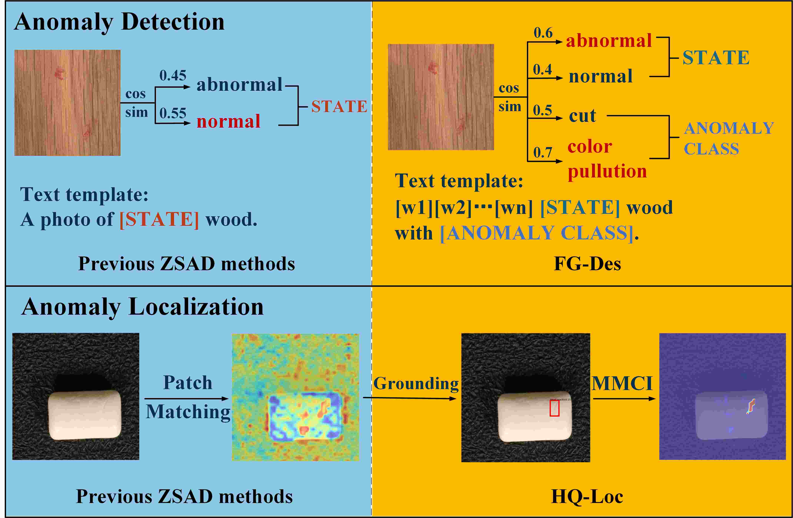
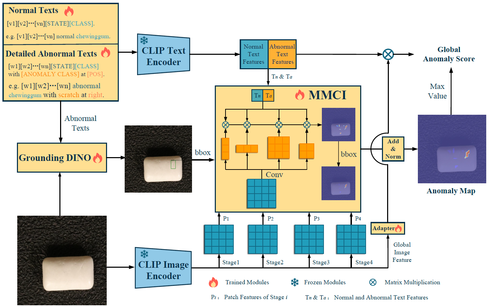

# FiLo: Zero-Shot Anomaly Detection by Fine-Grained Description and High-Quality Localization

Official implementation of paper [FiLo: Zero-Shot Anomaly Detection by Fine-Grained Description and High-Quality Localization](https://arxiv.org/abs/2404.13671) (ACM MM 2024).


## Introduction
Welcome to the official repository for "FiLo: Zero-Shot Anomaly Detection by Fine-Grained Description and High-Quality Localization." This work presents FiLo, an innovative method for Zero-Shot Anomaly Detection (ZSAD) that addresses the challenges of detecting and localizing anomalies without prior knowledge of normal or abnormal samples.

FiLo comprises two key components: Fine-Grained Description (FG-Des) and High-Quality Localization (HQ-Loc). FG-Des leverages Large Language Models (LLMs) to generate detailed anomaly descriptions for each object category, enhancing the accuracy and interpretability of anomaly detection. HQ-Loc improves localization by combining preliminary localization using Grounding DINO, position-enhanced text prompts, and a Multi-scale Multi-shape Cross-modal Interaction (MMCI) module, allowing for precise anomaly detection across various sizes and shapes.





## Overview of FiLo




## Running FiLo

### Environment Installation
Clone the repository locally:
```
git clone https://github.com/CASIA-IVA-Lab/FiLo.git
```
Install the required packages:
```
pip install -r requirements.txt
```

### Prepare Grounding DINO checkpoint

You can download our fine-tuned Grounding DINO model from the table below. We fine-tuned Grounding DINO using [MMDetection](https://github.com/open-mmlab/mmdetection). Consistent with FiLo's experimental setup, we tested Grounding DINO fine-tuned on the VisA dataset on the MVTec dataset and tested Grounding DINO fine-tuned on the MVTec dataset on the VisA dataset.


| **Training dataset** |      **Grounding DINO Weights Address**             |
| :-----------------:  |:-----------------------------------: |
|  MVTec  | [groundingdino_train_on_mvtec](https://huggingface.co/FantasticGNU/FiLo/blob/main/grounding_train_on_mvtec.pth) |
|  VisA   | [groundingdino_train_on_visa](https://huggingface.co/FantasticGNU/FiLo/blob/main/grounding_train_on_visa.pth) |


### Prepare FiLo checkpoint

You can download our pre-trained FiLo checkpoint from the table below.

| **Training dataset** |      **FiLo Weights Address**             |
| :-----------------:  |:-----------------------------------: |
|  MVTec  | [filo_train_on_mvtec](https://huggingface.co/FantasticGNU/FiLo/blob/main/filo_train_on_mvtec.pth) |
|  VisA   | [filo_train_on_visa](https://huggingface.co/FantasticGNU/FiLo/blob/main/filo_train_on_visa.pth) |


### Prepare data

#### MVTec AD
- Download and extract [MVTec AD](https://www.mvtec.com/company/research/datasets/mvtec-ad) into `data/mvtec`
- run`python data/mvtec.py` to obtain `data/mvtec/meta.json`
```
data
├── mvtec
    ├── meta.json
    ├── bottle
        ├── train
            ├── good
                ├── 000.png
        ├── test
            ├── good
                ├── 000.png
            ├── anomaly1
                ├── 000.png
        ├── ground_truth
            ├── anomaly1
                ├── 000.png
```

#### VisA
- Download and extract [VisA](https://amazon-visual-anomaly.s3.us-west-2.amazonaws.com/VisA_20220922.tar) into `data/visa`
- run`python data/visa.py` to obtain `data/visa/meta.json`
```
data
├── visa
    ├── meta.json
    ├── candle
        ├── Data
            ├── Images
                ├── Anomaly
                    ├── 000.JPG
                ├── Normal
                    ├── 0000.JPG
            ├── Masks
                ├── Anomaly
                    ├── 000.png
```


### Test our model
You can refer to the parameter settings in ``test.sh`` to modify the dataset path and checkpoint path for testing.
```
bash test.sh
```

### Train your own weights
```
bash train.sh
```


## Citation:
If you found FiLo useful in your research or applications, please kindly cite using the following BibTeX:
```
@article{gu2024filo,
  title={FiLo: Zero-Shot Anomaly Detection by Fine-Grained Description and High-Quality Localization},
  author={Gu, Zhaopeng and Zhu, Bingke and Zhu, Guibo and Chen, Yingying and Li, Hao and Tang, Ming and Wang, Jinqiao},
  journal={arXiv preprint arXiv:2404.13671},
  year={2024}
}
```